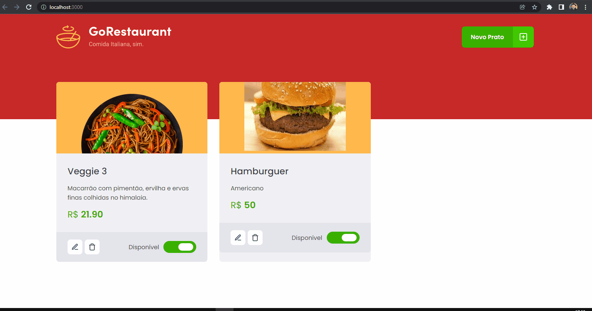

<h1 align="center">
  
   
  Go Restaurant - Migration: from Javascript to Typescript and from Class Components to Function Components 
</h1>

<h3 align="justify">
Didactic application an electronic menu with editing, inclusion and exclusion functions using initially ReactJS and being converted to and the TypeScript super set. Fake API concepts with JSON Server and error indication with toastify. The concepts of Componentization and Hook were used. The functionalities obtained in the challenge are to add a new product, remove product, edit product value, insert name in the product, insert photo in the product, indication of availability and description of the product. Credits for RocketSeat's ReactJS Track Chapter 2 Challenge 2.
</h3>
 

## 📷 Demonstration

<h4 align="left"></h4>
  

 

## 🚀 Technologies

This project was developed with the following technologies:

- [TypeScript](https://www.typescriptlang.org/docs/)
- [ReactJS](https://reactjs.org/)
- [JSONServer](https://github.com/typicode/json-server)
- [Axios](https://axios-http.com/docs/intro)

 

## ⚙ Commands Running locally Client
- yarn start

## ⚙ Commands Running locally Server
- yarn server

## ⚙ Documentatios
- <a href=".github/Documentation.pdf">PDF</a>
- [RocketSeat](https://www.notion.so/Desafio-02-Refactoring-de-classes-e-typescript-4571541e7f8c4799bd191b6cfb53802c)
 

Made with 💜 by Rafael Maciel
